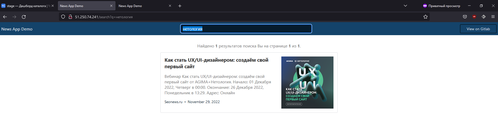
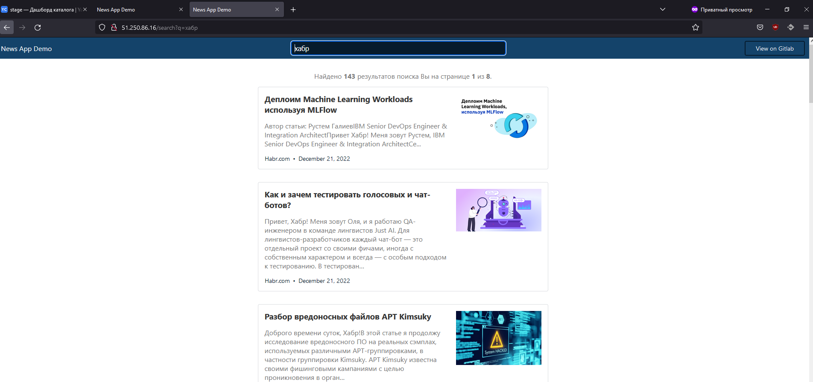
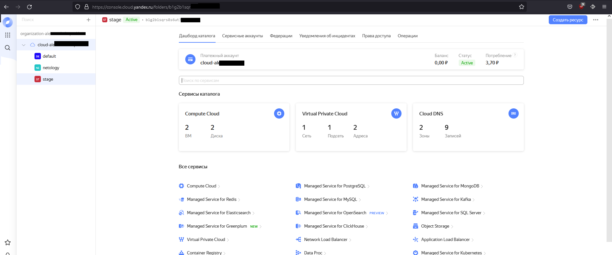

## Задача 1. Создадим бэкэнд в S3 (необязательно, но крайне желательно).

Если в рамках предыдущего задания у вас уже есть аккаунт AWS, то давайте продолжим знакомство со взаимодействием
терраформа и aws. 

1. Создайте s3 бакет, iam роль и пользователя от которого будет работать терраформ. Можно создать отдельного пользователя,
а можно использовать созданного в рамках предыдущего задания, просто добавьте ему необходимы права, как описано 
[здесь](https://www.terraform.io/docs/backends/types/s3.html).
1. Зарегистрируйте бэкэнд в терраформ проекте как описано по ссылке выше. 

## Решение  
К Амазону доступа нет. Аналогичная задача с яндекс-облаком решалась в предыдущем ДЗ. Единственный момент согласно ридми экспортировал переменные.  
export TF_VAR_yc_token=$(yc iam create-token)  
export TF_VAR_yc_cloud_id=$(yc config get cloud-id)  

## Примечание  
После отработки терраформа и попытки запуска ансибл вылетала ошибка:
~~~
sh: 1: source: not found
~~~

Как всегда стековерфлоу выручает: https://stackoverflow.com/questions/13702425/source-command-not-found-in-sh-shell  





## Задача 2. Инициализируем проект и создаем воркспейсы. 

1. Выполните `terraform init`:
    * если был создан бэкэнд в S3, то терраформ создат файл стейтов в S3 и запись в таблице 
dynamodb.
    * иначе будет создан локальный файл со стейтами.  
1. Создайте два воркспейса `stage` и `prod`.
1. В уже созданный `aws_instance` добавьте зависимость типа инстанса от вокспейса, что бы в разных ворскспейсах 
использовались разные `instance_type`.
1. Добавим `count`. Для `stage` должен создаться один экземпляр `ec2`, а для `prod` два. 
1. Создайте рядом еще один `aws_instance`, но теперь определите их количество при помощи `for_each`, а не `count`.
1. Что бы при изменении типа инстанса не возникло ситуации, когда не будет ни одного инстанса добавьте параметр
жизненного цикла `create_before_destroy = true` в один из рессурсов `aws_instance`.
1. При желании поэкспериментируйте с другими параметрами и рессурсами.

В виде результата работы пришлите:
* Вывод команды `terraform workspace list`.
* Вывод команды `terraform plan` для воркспейса `prod`. 

## Решение  
```
[root@vmtester2 demo]# terraform workspace list
  default
* prod
  stage

[root@vmtester2 demo]# terraform plan
module.vpc.data.yandex_compute_image.nat_instance: Reading...
module.vpc.data.yandex_compute_image.nat_instance: Read complete after 1s [id=fd8o8aph4t4pdisf1fio]

Terraform used the selected providers to generate the following execution plan. Resource actions are indicated with the following symbols:
  + create
 <= read (data resources)

Terraform will perform the following actions:

  # module.instance["balancer"].data.yandex_compute_image.image will be read during apply
  # (depends on a resource or a module with changes pending)
 <= data "yandex_compute_image" "image" {
      + created_at    = (known after apply)
      + description   = (known after apply)
      + family        = "centos-7"
      + folder_id     = (known after apply)
      + id            = (known after apply)
      + image_id      = (known after apply)
      + labels        = (known after apply)
      + min_disk_size = (known after apply)
      + name          = (known after apply)
      + os_type       = (known after apply)
      + product_ids   = (known after apply)
      + size          = (known after apply)
      + status        = (known after apply)
    }

  # module.instance["balancer"].yandex_compute_instance.instance[0] will be created
  + resource "yandex_compute_instance" "instance" {
      + created_at                = (known after apply)
      + description               = "News App Demo"
      + folder_id                 = (known after apply)
      + fqdn                      = (known after apply)
      + hostname                  = "balancer-1"
      + id                        = (known after apply)
      + metadata                  = {
          + "ssh-keys" = <<-EOT
                centos:ssh-rsa AAAAB3NzaC1yc2EAAAADAQABAAABgQCU+888**
            EOT
        }
      + name                      = "balancer-1"
      + network_acceleration_type = "standard"
      + platform_id               = "standard-v2"
      + service_account_id        = (known after apply)
      + status                    = (known after apply)
      + zone                      = "ru-central1-a"

      + boot_disk {
          + auto_delete = true
          + device_name = (known after apply)
          + disk_id     = (known after apply)
          + mode        = (known after apply)

          + initialize_params {
              + description = (known after apply)
              + image_id    = (known after apply)
              + name        = (known after apply)
              + size        = 40
              + snapshot_id = (known after apply)
              + type        = "network-ssd"
            }
        }

      + network_interface {
          + index              = (known after apply)
          + ip_address         = (known after apply)
          + ipv4               = true
          + ipv6               = (known after apply)
          + ipv6_address       = (known after apply)
          + mac_address        = (known after apply)
          + nat                = true
          + nat_ip_address     = (known after apply)
          + nat_ip_version     = (known after apply)
          + security_group_ids = (known after apply)
          + subnet_id          = (known after apply)
        }

      + placement_policy {
          + placement_group_id = (known after apply)
        }

      + resources {
          + core_fraction = 100
          + cores         = 2
          + memory        = 2
        }

      + scheduling_policy {
          + preemptible = (known after apply)
        }
    }

  # module.instance["news"].data.yandex_compute_image.image will be read during apply
  # (depends on a resource or a module with changes pending)
 <= data "yandex_compute_image" "image" {
      + created_at    = (known after apply)
      + description   = (known after apply)
      + family        = "centos-7"
      + folder_id     = (known after apply)
      + id            = (known after apply)
      + image_id      = (known after apply)
      + labels        = (known after apply)
      + min_disk_size = (known after apply)
      + name          = (known after apply)
      + os_type       = (known after apply)
      + product_ids   = (known after apply)
      + size          = (known after apply)
      + status        = (known after apply)
    }

  # module.instance["news"].yandex_compute_instance.instance[0] will be created
  + resource "yandex_compute_instance" "instance" {
      + created_at                = (known after apply)
      + description               = "News App Demo"
      + folder_id                 = (known after apply)
      + fqdn                      = (known after apply)
      + hostname                  = "news-1"
      + id                        = (known after apply)
      + metadata                  = {
          + "ssh-keys" = <<-EOT
                centos:ssh-rsa AAAAB3NzaC1yc2EAAAADAQABAAABgQCU+d4MEt8NXUlYSccP206bMl7bsAWM2lYLTr0PuUC5bjNn3BKCU3b**
            EOT
        }
      + name                      = "news-1"
      + network_acceleration_type = "standard"
      + platform_id               = "standard-v2"
      + service_account_id        = (known after apply)
      + status                    = (known after apply)
      + zone                      = "ru-central1-a"

      + boot_disk {
          + auto_delete = true
          + device_name = (known after apply)
          + disk_id     = (known after apply)
          + mode        = (known after apply)

          + initialize_params {
              + description = (known after apply)
              + image_id    = (known after apply)
              + name        = (known after apply)
              + size        = 40
              + snapshot_id = (known after apply)
              + type        = "network-ssd"
            }
        }

      + network_interface {
          + index              = (known after apply)
          + ip_address         = (known after apply)
          + ipv4               = true
          + ipv6               = (known after apply)
          + ipv6_address       = (known after apply)
          + mac_address        = (known after apply)
          + nat                = true
          + nat_ip_address     = (known after apply)
          + nat_ip_version     = (known after apply)
          + security_group_ids = (known after apply)
          + subnet_id          = (known after apply)
        }

      + placement_policy {
          + placement_group_id = (known after apply)
        }

      + resources {
          + core_fraction = 100
          + cores         = 2
          + memory        = 2
        }

      + scheduling_policy {
          + preemptible = (known after apply)
        }
    }

  # module.instance["news"].yandex_compute_instance.instance[1] will be created
  + resource "yandex_compute_instance" "instance" {
      + created_at                = (known after apply)
      + description               = "News App Demo"
      + folder_id                 = (known after apply)
      + fqdn                      = (known after apply)
      + hostname                  = "news-2"
      + id                        = (known after apply)
      + metadata                  = {
          + "ssh-keys" = <<-EOT
                centos:ssh-rsa AAAAB3NzaC1yc2EAAAADAQABAAABgQCU+d4MEt8NXUlYSccP206bMl7bsAWM2lYLTr0PuUC5bjNn3BKCU3boc7**
            EOT
        }
      + name                      = "news-2"
      + network_acceleration_type = "standard"
      + platform_id               = "standard-v2"
      + service_account_id        = (known after apply)
      + status                    = (known after apply)
      + zone                      = "ru-central1-a"

      + boot_disk {
          + auto_delete = true
          + device_name = (known after apply)
          + disk_id     = (known after apply)
          + mode        = (known after apply)

          + initialize_params {
              + description = (known after apply)
              + image_id    = (known after apply)
              + name        = (known after apply)
              + size        = 40
              + snapshot_id = (known after apply)
              + type        = "network-ssd"
            }
        }

      + network_interface {
          + index              = (known after apply)
          + ip_address         = (known after apply)
          + ipv4               = true
          + ipv6               = (known after apply)
          + ipv6_address       = (known after apply)
          + mac_address        = (known after apply)
          + nat                = true
          + nat_ip_address     = (known after apply)
          + nat_ip_version     = (known after apply)
          + security_group_ids = (known after apply)
          + subnet_id          = (known after apply)
        }

      + placement_policy {
          + placement_group_id = (known after apply)
        }

      + resources {
          + core_fraction = 100
          + cores         = 2
          + memory        = 2
        }

      + scheduling_policy {
          + preemptible = (known after apply)
        }
    }

  # module.instance["redis"].data.yandex_compute_image.image will be read during apply
  # (depends on a resource or a module with changes pending)
 <= data "yandex_compute_image" "image" {
      + created_at    = (known after apply)
      + description   = (known after apply)
      + family        = "centos-7"
      + folder_id     = (known after apply)
      + id            = (known after apply)
      + image_id      = (known after apply)
      + labels        = (known after apply)
      + min_disk_size = (known after apply)
      + name          = (known after apply)
      + os_type       = (known after apply)
      + product_ids   = (known after apply)
      + size          = (known after apply)
      + status        = (known after apply)
    }

  # module.instance["redis"].yandex_compute_instance.instance[0] will be created
  + resource "yandex_compute_instance" "instance" {
      + created_at                = (known after apply)
      + description               = "News App Demo"
      + folder_id                 = (known after apply)
      + fqdn                      = (known after apply)
      + hostname                  = "redis-1"
      + id                        = (known after apply)
      + metadata                  = {
          + "ssh-keys" = <<-EOT
                centos:ssh-rsa AAAAB3NzaC1yc2EAAAADAQABAAABgQCU+d4MEt8NXUlYSccP206bMl7bsAWM2lYLTr0PuUC5bjNn3B**
            EOT
        }
      + name                      = "redis-1"
      + network_acceleration_type = "standard"
      + platform_id               = "standard-v2"
      + service_account_id        = (known after apply)
      + status                    = (known after apply)
      + zone                      = "ru-central1-a"

      + boot_disk {
          + auto_delete = true
          + device_name = (known after apply)
          + disk_id     = (known after apply)
          + mode        = (known after apply)

          + initialize_params {
              + description = (known after apply)
              + image_id    = (known after apply)
              + name        = (known after apply)
              + size        = 40
              + snapshot_id = (known after apply)
              + type        = "network-ssd"
            }
        }

      + network_interface {
          + index              = (known after apply)
          + ip_address         = (known after apply)
          + ipv4               = true
          + ipv6               = (known after apply)
          + ipv6_address       = (known after apply)
          + mac_address        = (known after apply)
          + nat                = true
          + nat_ip_address     = (known after apply)
          + nat_ip_version     = (known after apply)
          + security_group_ids = (known after apply)
          + subnet_id          = (known after apply)
        }

      + placement_policy {
          + placement_group_id = (known after apply)
        }

      + resources {
          + core_fraction = 100
          + cores         = 2
          + memory        = 2
        }

      + scheduling_policy {
          + preemptible = (known after apply)
        }
    }

  # module.instance["redis"].yandex_compute_instance.instance[1] will be created
  + resource "yandex_compute_instance" "instance" {
      + created_at                = (known after apply)
      + description               = "News App Demo"
      + folder_id                 = (known after apply)
      + fqdn                      = (known after apply)
      + hostname                  = "redis-2"
      + id                        = (known after apply)
      + metadata                  = {
          + "ssh-keys" = <<-EOT
                centos:ssh-rsa AAAAB3NzaC1yc2EAAAADAQABAAABgQCU+d4MEt8NXUlYSccP206bMl7bsAWM2lYLTr0PuUC5bjNn3B**
            EOT
        }
      + name                      = "redis-2"
      + network_acceleration_type = "standard"
      + platform_id               = "standard-v2"
      + service_account_id        = (known after apply)
      + status                    = (known after apply)
      + zone                      = "ru-central1-a"

      + boot_disk {
          + auto_delete = true
          + device_name = (known after apply)
          + disk_id     = (known after apply)
          + mode        = (known after apply)

          + initialize_params {
              + description = (known after apply)
              + image_id    = (known after apply)
              + name        = (known after apply)
              + size        = 40
              + snapshot_id = (known after apply)
              + type        = "network-ssd"
            }
        }

      + network_interface {
          + index              = (known after apply)
          + ip_address         = (known after apply)
          + ipv4               = true
          + ipv6               = (known after apply)
          + ipv6_address       = (known after apply)
          + mac_address        = (known after apply)
          + nat                = true
          + nat_ip_address     = (known after apply)
          + nat_ip_version     = (known after apply)
          + security_group_ids = (known after apply)
          + subnet_id          = (known after apply)
        }

      + placement_policy {
          + placement_group_id = (known after apply)
        }

      + resources {
          + core_fraction = 100
          + cores         = 2
          + memory        = 2
        }

      + scheduling_policy {
          + preemptible = (known after apply)
        }
    }

  # module.instance["redis"].yandex_compute_instance.instance[2] will be created
  + resource "yandex_compute_instance" "instance" {
      + created_at                = (known after apply)
      + description               = "News App Demo"
      + folder_id                 = (known after apply)
      + fqdn                      = (known after apply)
      + hostname                  = "redis-3"
      + id                        = (known after apply)
      + metadata                  = {
          + "ssh-keys" = <<-EOT
                centos:ssh-rsa AAAAB3NzaC1yc2EAAAADAQABAAABgQCU+d4MEt8NXUlYSccP206bMl7bsAWM2lYLTr0PuUC5bjNn3BKCU**
            EOT
        }
      + name                      = "redis-3"
      + network_acceleration_type = "standard"
      + platform_id               = "standard-v2"
      + service_account_id        = (known after apply)
      + status                    = (known after apply)
      + zone                      = "ru-central1-a"

      + boot_disk {
          + auto_delete = true
          + device_name = (known after apply)
          + disk_id     = (known after apply)
          + mode        = (known after apply)

          + initialize_params {
              + description = (known after apply)
              + image_id    = (known after apply)
              + name        = (known after apply)
              + size        = 40
              + snapshot_id = (known after apply)
              + type        = "network-ssd"
            }
        }

      + network_interface {
          + index              = (known after apply)
          + ip_address         = (known after apply)
          + ipv4               = true
          + ipv6               = (known after apply)
          + ipv6_address       = (known after apply)
          + mac_address        = (known after apply)
          + nat                = true
          + nat_ip_address     = (known after apply)
          + nat_ip_version     = (known after apply)
          + security_group_ids = (known after apply)
          + subnet_id          = (known after apply)
        }

      + placement_policy {
          + placement_group_id = (known after apply)
        }

      + resources {
          + core_fraction = 100
          + cores         = 2
          + memory        = 2
        }

      + scheduling_policy {
          + preemptible = (known after apply)
        }
    }

  # module.vpc.yandex_resourcemanager_folder.folder[0] will be created
  + resource "yandex_resourcemanager_folder" "folder" {
      + cloud_id    = (known after apply)
      + created_at  = (known after apply)
      + description = "terraform managed"
      + id          = (known after apply)
      + name        = "prod"
    }

  # module.vpc.yandex_vpc_network.this will be created
  + resource "yandex_vpc_network" "this" {
      + created_at                = (known after apply)
      + default_security_group_id = (known after apply)
      + description               = "managed by terraform prod network"
      + folder_id                 = (known after apply)
      + id                        = (known after apply)
      + name                      = "prod"
      + subnet_ids                = (known after apply)
    }

  # module.vpc.yandex_vpc_subnet.this["ru-central1-a"] will be created
  + resource "yandex_vpc_subnet" "this" {
      + created_at     = (known after apply)
      + description    = "managed by terraform prod subnet for zone ru-central1-a"
      + folder_id      = (known after apply)
      + id             = (known after apply)
      + name           = "prod-ru-central1-a"
      + network_id     = (known after apply)
      + v4_cidr_blocks = [
          + "10.128.0.0/24",
        ]
      + v6_cidr_blocks = (known after apply)
      + zone           = "ru-central1-a"
    }

  # module.vpc.yandex_vpc_subnet.this["ru-central1-b"] will be created
  + resource "yandex_vpc_subnet" "this" {
      + created_at     = (known after apply)
      + description    = "managed by terraform prod subnet for zone ru-central1-b"
      + folder_id      = (known after apply)
      + id             = (known after apply)
      + name           = "prod-ru-central1-b"
      + network_id     = (known after apply)
      + v4_cidr_blocks = [
          + "10.129.0.0/24",
        ]
      + v6_cidr_blocks = (known after apply)
      + zone           = "ru-central1-b"
    }

  # module.vpc.yandex_vpc_subnet.this["ru-central1-c"] will be created
  + resource "yandex_vpc_subnet" "this" {
      + created_at     = (known after apply)
      + description    = "managed by terraform prod subnet for zone ru-central1-c"
      + folder_id      = (known after apply)
      + id             = (known after apply)
      + name           = "prod-ru-central1-c"
      + network_id     = (known after apply)
      + v4_cidr_blocks = [
          + "10.130.0.0/24",
        ]
      + v6_cidr_blocks = (known after apply)
      + zone           = "ru-central1-c"
    }

Plan: 11 to add, 0 to change, 0 to destroy.

Changes to Outputs:
  + public_ip = {
      + balancer = [
          + (known after apply),
        ]
      + news     = [
          + (known after apply),
          + (known after apply),
        ]
      + redis    = [
          + (known after apply),
          + (known after apply),
          + (known after apply),
        ]
    }

────────────────────────────────────────────────────────────────────────────────────────────────────────────────────────────────────────────────────────────────────────────────────────────────────────────────────────────────────────────

Note: You didn't use the -out option to save this plan, so Terraform can't guarantee to take exactly these actions if you run "terraform apply" now.
```
